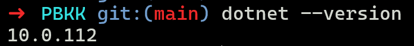
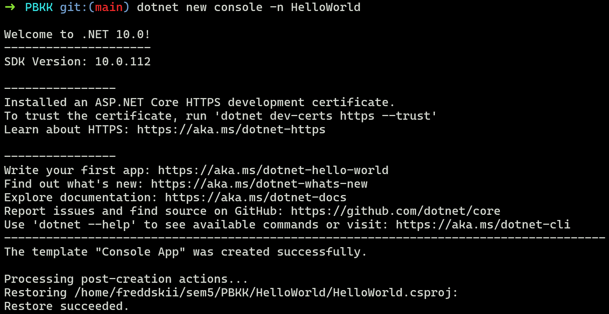
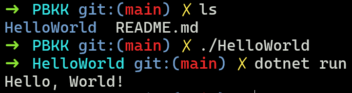
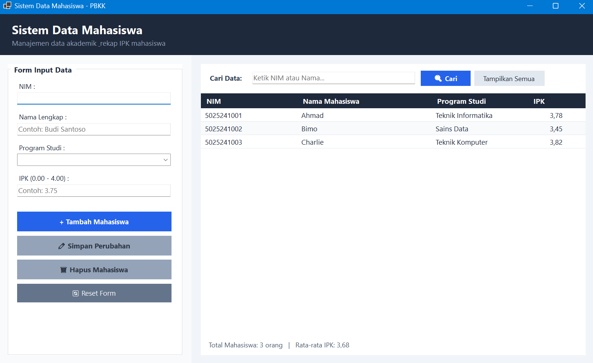
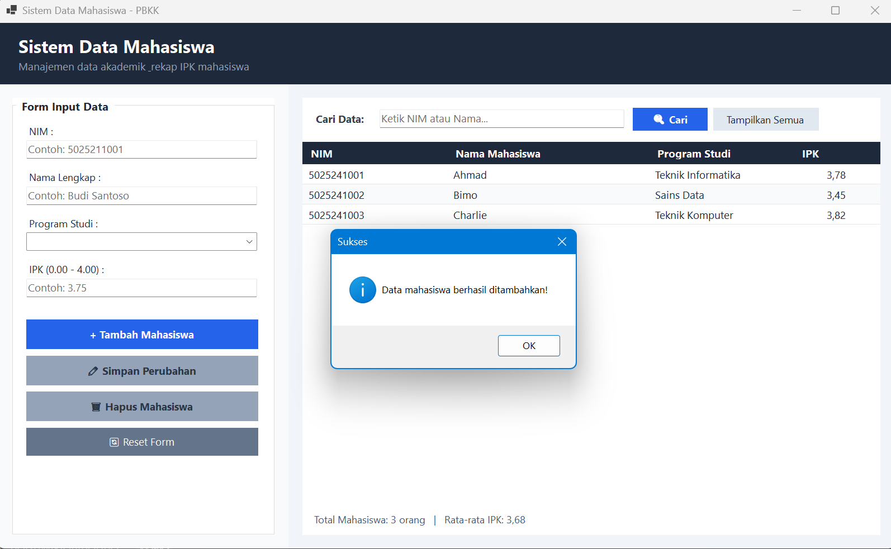
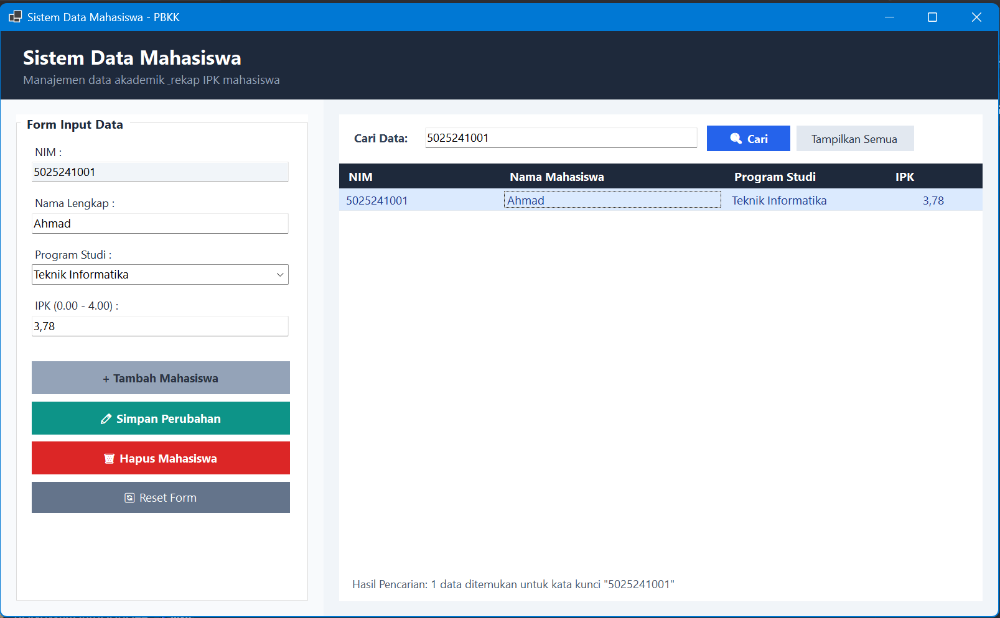
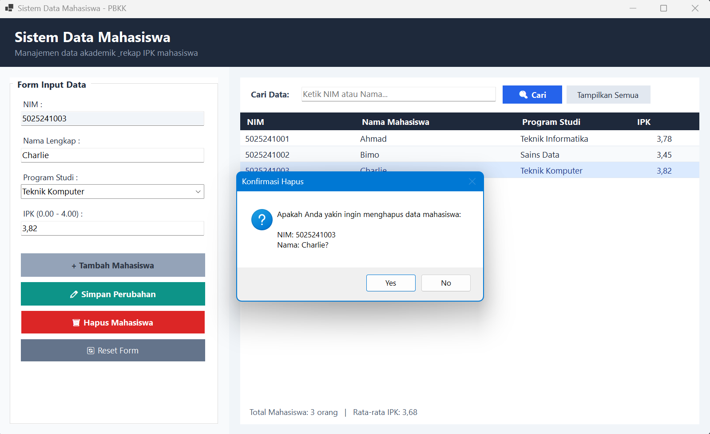
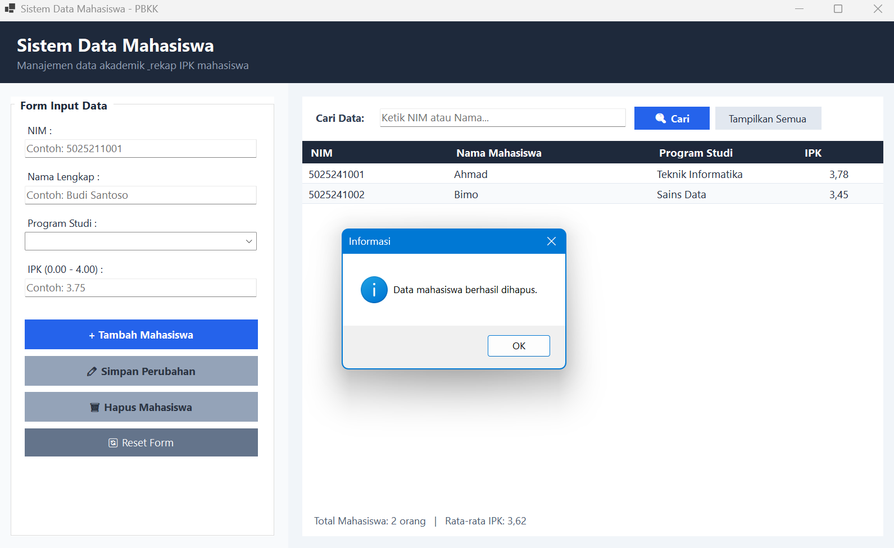
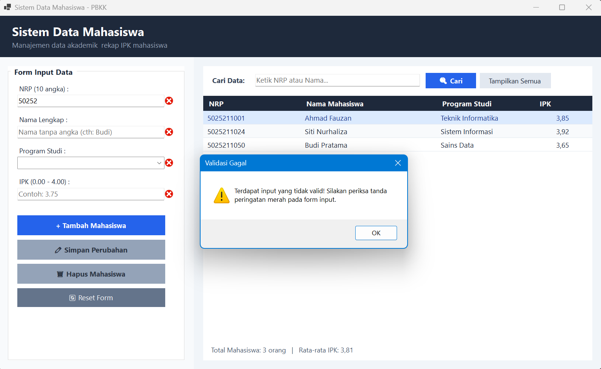

# Latihan 1 PBKK

| Nama | NRP | Mata Kuliah | Kelas | 
| --- | --- | --- | --- | 
| Liem, Alfred Haryanto | 5025241100 | Pemrograman Berbasis Kerangka Kerja | D |


## 1. Hello World Console

Pada bagian pertama ini bertujuan untuk membuat program simple yang akan melakukan print "Hello World!" pada console, adapun langkah-langkah nya sebagai berikut:

### Build & Run
1. Inisialisasi project console:
```bash
dotnet new console -n HelloWorld 
```

2. Masuk ke folder project dan jalankan:
```bash
cd HelloWorld
dotnet run
```







## 2. Sistem Data Mahasiswa (Desktop GUI)

Pada bagian kedua ini bertujuan untuk membuat desktop app sederhana menggunakan **C# Windows Forms**. App yang dibuat adalah CRUD data mahasiswa, meliputi menambah data, mengubah data, menghapus data, dan membaca data. Berikut merupakan langkah-langkah dalam membuat app tersebut:

### Build dan Inisialisasi
1. Inisialisasi project winforms:
```bash
dotnet new winforms -n sistem_data_mahasiswa 
```

2. Masuk ke folder project:
```bash
cd sistem_data_mahasiswa
dotnet run
```


### Fitur Utama
- **Form Input Sidebar** → Panel kiri untuk input data mahasiswa (NRP, Nama, Prodi, IPK).
- **Tabel Data Interactive** → Panel kanan menampilkan daftar mahasiswa dengan `DataGridView` berdesain Dark Mode modern.
- **Auto-Fill Input** → Klik baris tabel, data otomatis masuk kembali ke form input sidebar.
- **Pencarian & Penghapusan** → Cari data berdasarkan NIM/NRP atau hapus data dengan dialog konfirmasi.
- **Validasi Data Menyeluruh** → Validasi NRP (tepat 10 digit angka), Nama (hanya huruf & spasi, minimal 3 karakter), Prodi, dan IPK (rentang 0.00 – 4.00) dengan pembatasan langsung saat mengetik (`KeyPress`).

### Tampilan Aplikasi
1. Tampilan Awal



2. Tambahkan Data



3. Mencari Data



4. Menghapus Data






5. Akan muncul pesan / peringatan apabila input yang diberikan tidak valid atau tidak sesuai

